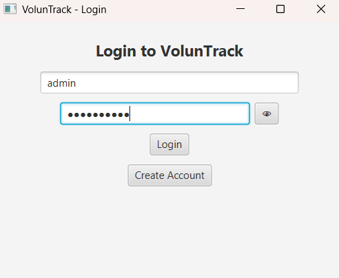
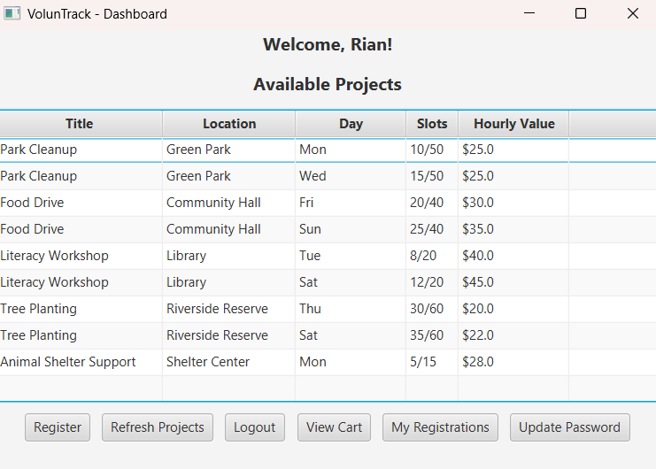
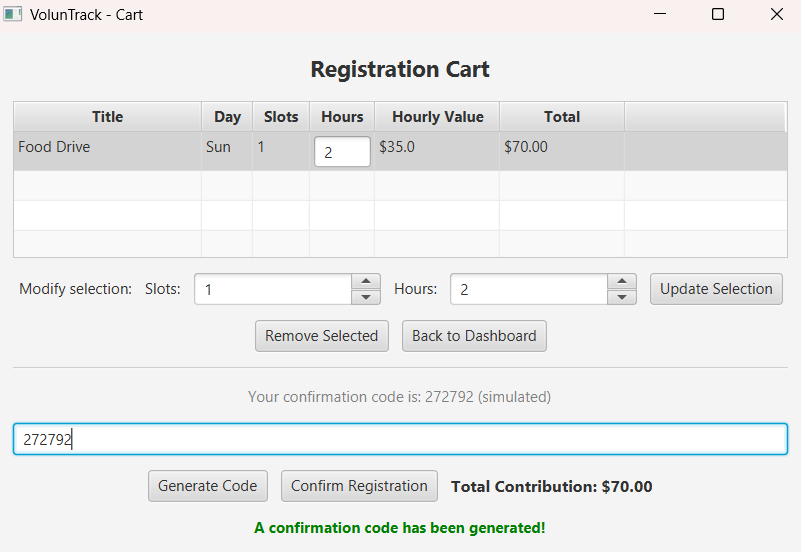
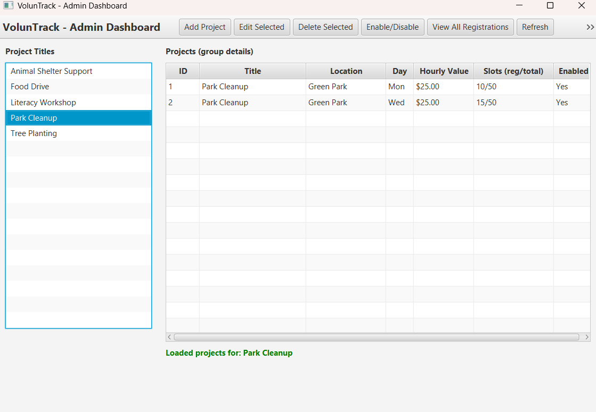

# VolunTrack

A desktop volunteer management application built with **Java 21**, **JavaFX**, **SQLite**, and **Maven**. VolunTrack allows volunteers to browse and register for community projects, while providing administrators with tools to manage projects, registrations, and participation records.

This project demonstrates object-oriented programming, MVC architecture, desktop application development, database integration, authentication, and automated testing.

---

## Screenshots

### Login Screen

The application begins with a secure login system supporting both volunteer users and administrators.

<p align="center">
  
</p>

---

### Volunteer Dashboard

The volunteer dashboard allows users to browse available community projects and manage their registrations.

<p align="center">
  
</p>

---

### Project Registration

Volunteers can register for available projects while specifying their participation details.

<p align="center">
  
</p>

---

### Administrator Dashboard

Administrators have access to project management tools, registration oversight, and system administration features.

<p align="center">
  
</p>

---

## Features

### Volunteer Features

* Secure user registration and login
* Password hashing using SHA-256
* Browse available volunteer projects
* Register for community projects
* Registration confirmation and validation
* View participation history
* Export participation history to CSV
* Update account password

### Administrator Features

* Secure administrator login
* Create new volunteer projects
* Edit existing projects
* Enable or disable projects
* View volunteer registrations
* Manage project capacity and volunteer hours

---

## Technology Stack

| Technology | Purpose                          |
| ---------- | -------------------------------- |
| Java 21    | Core application development     |
| JavaFX     | Desktop graphical user interface |
| SQLite     | Embedded relational database     |
| Maven      | Dependency and build management  |
| JUnit 5    | Unit testing                     |
| SHA-256    | Password hashing                 |
| Git        | Version control                  |

---

## Architecture

VolunTrack follows the **Model-View-Controller (MVC)** design pattern.

```text
JavaFX Views (FXML)
        │
        ▼
Controllers
        │
        ▼
Models & Business Logic
        │
        ▼
SQLite Database
```

The application separates the user interface, application logic, and data layer to improve maintainability and make future enhancements easier.

---

## Project Structure

```text
src
├── main
│   ├── java
│   │   ├── controller
│   │   ├── model
│   │   ├── util
│   │   └── App.java
│   └── resources
│       └── view
└── test
    └── java
```

Additional technical documentation is available in the `docs` directory.

---

## Installation

### Prerequisites

* Java Development Kit (JDK) 21
* Apache Maven 3.9 or later

### Clone the repository

```bash
git clone https://github.com/RJLaursen/VolunTrack.git
cd VolunTrack
```

---

## Running the Application

Compile the project:

```bash
mvn clean compile
```

Launch the application:

```bash
mvn javafx:run
```

On first launch the application will:

* Automatically create the SQLite database (`voluntrack.db`) if it does not already exist.
* Import the default volunteer projects from `projects.csv`.
* Create the default administrator account if one does not already exist.

### Default Administrator Account

**Username**

```text
admin
```

**Password**

```text
Admin654!@
```

---

## Testing

The project includes automated **JUnit 5** tests covering core application functionality.

Run all tests using:

```bash
mvn test
```

---

## Future Improvements

Potential future enhancements include:

* Multiple administrator accounts with role-based permissions
* Search and filtering for volunteer projects
* Email confirmation for registrations
* Dashboard analytics and reporting
* REST API for web or mobile integration
* Support for external database systems such as PostgreSQL

---

## Learning Outcomes

This project provided practical experience with:

* Object-oriented software development
* JavaFX desktop application development
* MVC software architecture
* SQLite database integration
* User authentication and password security
* File import/export using CSV
* Automated testing with JUnit
* Dependency management using Maven
* Version control with Git

---

## License

This repository is provided for portfolio and educational purposes.
