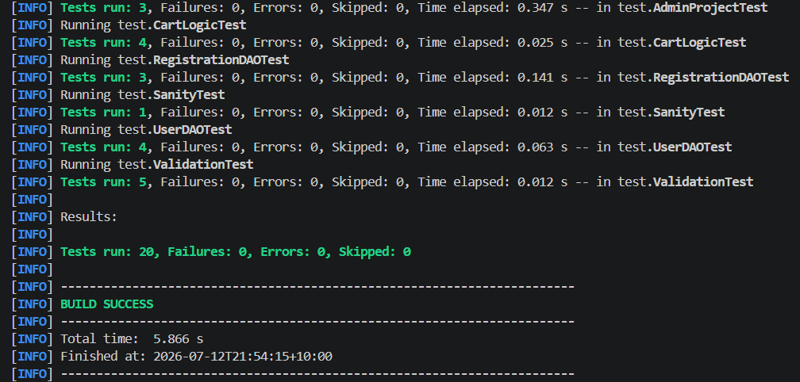

# Testing Documentation

## Overview

VolunTrack includes automated testing using **JUnit 5** to verify important application functionality and ensure core systems behave as expected.

The test suite focuses on validating business logic, database operations, user management, and input validation.

---

## Testing Framework

The project uses:

| Tool                  | Purpose                                      |
| --------------------- | -------------------------------------------- |
| JUnit 5               | Automated unit testing                       |
| Maven Surefire Plugin | Running tests through the Maven build system |
| SQLite Test Mode      | Isolated database testing                    |

Tests can be executed using:

```bash
mvn test
```

---

# Test Coverage

## User Management Testing

**Test File:**

```
UserDAOTest.java
```

Tests user account functionality including:

* Creating new user accounts
* Preventing duplicate usernames and emails
* Successful user authentication
* Failed login attempts

These tests verify that user registration and login functionality operate correctly.

---

## Input Validation Testing

**Test File:**

```
ValidationTest.java
```

Tests validation rules used during account creation.

Coverage includes:

* Valid password acceptance
* Password complexity requirements
* Uppercase character validation
* Number requirement validation
* Special character requirement validation
* Email format validation

---

## Project Management Testing

**Test File:**

```
AdminProjectTest.java
```

Tests administrator project management functionality.

Coverage includes:

* Creating new projects
* Preventing duplicate projects
* Removing projects

These tests ensure that project data can be safely managed through administrator functions.

---

## Shopping Cart / Registration Selection Testing

**Test File:**

```
CartLogicTest.java
```

Tests the project selection cart system used before confirming registrations.

Coverage includes:

* Adding projects to the cart
* Preventing duplicate project selections
* Removing projects from the cart
* Clearing cart contents

---

## Registration Database Testing

**Test File:**

```
RegistrationDAOTest.java
```

Tests the registration process between users and volunteer projects.

Coverage includes:

* Creating users for testing
* Creating projects for testing
* Successful registrations
* Duplicate registration prevention
* Invalid volunteer hour handling

These tests verify that registration rules are correctly enforced before storing data.

---

## Sanity Testing

**Test File:**

```
SanityTest.java
```

A simple validation test used to confirm the testing environment is correctly configured.

---

# Test Results

All automated tests were executed successfully using Maven.

Example output:

```
mvn test

BUILD SUCCESS
```

The completed test suite confirms that the core functionality of VolunTrack operates as expected, including user management, project handling, registration workflows, and validation logic.



---

# Testing Approach

The testing strategy focused on validating important application behaviours rather than individual interface elements.

The main areas tested were:

* Data persistence
* User authentication
* Input validation
* Duplicate prevention
* Registration rules
* Core business logic

This approach helps ensure that changes to the application do not unintentionally break existing functionality.
